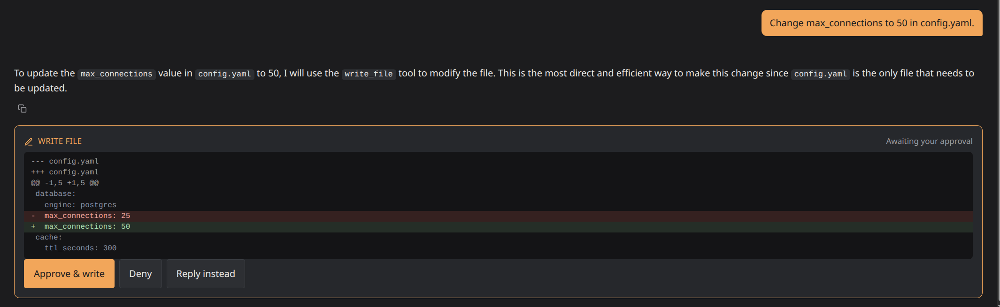

<p align="center">
  
</p>

<h1 align="center">Flint</h1>

<p align="center">An offline orchestration layer and chat UI for local Ollama models, built to get the most out of small models.</p>

<p align="center">
  <a href="https://github.com/Lusan-sapkota/Flint/releases/latest"></a>
  <a href="https://flint.lusansapkota.com.np"></a>
  <a href="https://flint.lusansapkota.com.np/changelog.html"></a>
</p>

No CDN calls, no telemetry, no cloud dependency. Everything the frontend
needs is vendored, and the backend only talks to your Ollama. The one
deliberate exception is `@web <query>`, which searches the web through the
Brave Search API with your own key, only when you ask, sending only the
query text. Ollama cloud models (`:cloud`) run on ollama.com, so Flint tags
them "cloud" and says so in the chat.

**New in 0.4.0:** with a cloud model, a turn's edits are staged and reviewed
together after its reply: one card shows every changed file, with Write
all and Discard all, and halved the approvals for a change across two
files in testing. Any diff with more than one change can be written in
part, one checkbox per change. An edit that removes a name the file still
uses (a rename that stopped at the import) is pointed at the lines that
still use it.
([features](docs/features.html#reviewing-a-cloud-models-edits), [experiments](docs/experiments.html#e32-multi-file-edits-for-cloud-models), [changelog](docs/changelog.html))

0.3.0 added file tools: the model reads, edits and creates files in your
attached folder. It reads on its own, inside the folder only and never a
secret the shield blocks (with a cloud model, only after you approve each
read); every edit is shown as a red/green diff and written only when you
approve it. The
folder's real file paths sit next to where the model writes, so it names
files that exist instead of guessing, and any file it mentions that isn't
there is flagged under its reply.
([features](docs/features.html#folder-attach-and-the-shell-tool), [security](docs/security.html#file-tools), [changelog](docs/changelog.html))

<p align="center">
  
</p>

0.2.0 added `@agent <task>`: a question over your folder split into
subtasks, each run by its own agent, with one answer from their results
([agents](docs/features.html#agents-agent)).

## Quick start

You need [Ollama](https://ollama.com) running with a model pulled, for
example `ollama pull qwen2.5:3b`.

**With Docker** (recommended). Flint runs in the container and talks to
the Ollama already on your machine. No clone needed, just the compose
file and a folder for your data:

```bash
mkdir flint && cd flint && mkdir data
# Linux
curl -O https://raw.githubusercontent.com/Lusan-sapkota/Flint/main/docker-compose.yml
docker compose up -d && echo "Flint is running at http://localhost:${FLINT_PORT:-3141}"
# Mac, Windows (Docker Desktop)
curl -O https://raw.githubusercontent.com/Lusan-sapkota/Flint/main/docker-compose.desktop.yml
docker compose -f docker-compose.desktop.yml up -d && echo "Flint is running at http://localhost:${FLINT_PORT:-3141}"
```

Then open `http://localhost:3141`, a deliberately uncommon port so it
doesn't collide with other dev servers (set `FLINT_PORT` to change it).

To update to a new release, run this in the same folder (add
`-f docker-compose.desktop.yml` on Mac and Windows). Your data in `./data`
is kept:

```bash
docker compose pull && docker compose up -d
docker image prune -f   # optional: remove the old image
```

`latest` only moves for normal releases, not pre-releases like
`v0.3.0-beta`. To stay on one version, pin its tag in the compose file,
for example `ghcr.io/lusan-sapkota/flint:0.2`.

**Or from source**, with Go installed:

```bash
git clone https://github.com/Lusan-sapkota/Flint.git
cd Flint/backend
go run .
```

Then open `http://localhost:8080` and sign up.

Optional, only if you use `@web`: `ollama pull nomic-embed-text` (about
270 MB) lets Flint re-rank search results against your question. It isn't
a dependency. Without it `@web` still works, using Brave's own ranking,
and with it the model only loads for the moment a search runs: Flint has
Ollama unload it as soon as the results are ranked.

Environment variables, Docker notes and which models need which
capabilities: [deployment](docs/deployment.html).

## Why

Local-LLM web UIs tend to be either too heavy (bundled RAG, Whisper and
torch stacks in a multi-GB image, just to chat) or too minimal (no history
at all). Flint sits in between: one small Go binary, SQLite, and a light
server-rendered UI.

The bet underneath: a well-guided 3-4B model isn't an inferior model, it's
an under-scaffolded one. The usual bottleneck isn't the model, it's naive
unbounded context, no discipline around tool calls, and no memory. Flint
acts as an **active orchestration layer** rather than a passive passthrough:
managing token budgets, isolating micro-agents (`@agent`), and shielding
shell tools without consuming the heavy RAM/VRAM footprint of Python/PyTorch
stacks. ([architecture](docs/architecture.html#orchestration-layer))

## Highlights

- **Long chats that never overflow.** A real context budget per request,
  background layered summaries that keep your own words verbatim, and
  `@compact` to condense on demand.
  ([context management](docs/context-management.html))
- **Shell and file tools you stay in control of.** Attach a folder and the
  model can propose commands through Ollama's native tool calling. Every
  command waits for your approval, a shield blocks catastrophic ones
  outright, and commands that can't work are caught before they reach
  you. It reads files in the folder on its own, and every edit is shown
  as a diff that's written only when you approve it.
  ([security](docs/security.html))
- **Agents for questions that span a folder.** `@agent <task>` splits a
  task into subtasks, each run by its own agent with a clean context
  window, then writes one answer from their results. You review and edit
  the plan first; an agent reads the files you give it, or looks through
  the folder with commands you approve, and you can open any agent to
  see exactly what it did. ([agents](docs/features.html#agents-agent))
- **Memory across chats.** `@memory save` keeps what matters (drafts are
  reviewed before saving), `@memory <words>` recalls it, and memories tied
  to a folder load whenever that folder is attached.
- **Web search on request.** `@web <query>`, re-ranked locally with
  Ollama embeddings.
- **Local first, cloud when you choose.** Built and tuned for small local
  models, and Ollama cloud models work too, under the same rules: every
  command still waits for your approval and passes the same safety
  checks. A cloud model is tagged "cloud", its chat says it's sent to
  ollama.com, and it gets its own context window setting.
- **Everything a chat UI needs:** streaming, thinking toggle, images and
  file attachments, chat search, offline math rendering, editable last
  message, automatic titles, model management.
  ([all features](docs/features.html))
- **Tested against real models, and written down.** Every design decision
  in the context pipeline comes with the measurement behind it, including
  the attempts that failed, and a scored benchmark measures each piece of
  scaffolding by switching it off. ([experiments](docs/experiments.html),
  [benchmark](docs/benchmark.html))


## Who it's for

Flint is a personal tool, built for one person on one machine: mine, a
laptop with a 6 GB GPU running 3-4B models. Everything is sized and tested
for that: the context budgets, the prompts, the models it's tuned on. It
runs on your own computer, listens on localhost, and isn't meant to be
exposed to a network or shared with other people. If you run it on a bigger
rig and something breaks or behaves oddly, please open an issue: that's
exactly the feedback I can't get from my own hardware.

## Documentation

Full documentation is available at **[flint.lusansapkota.com.np](https://flint.lusansapkota.com.np)**.

## Stack

Go and SQLite (pure-Go driver, no cgo) in a single static binary; htmx,
Alpine.js and Pico.css with no build step; [Ollama](https://ollama.com) for
the models.

## License

AGPL-3.0, see [LICENSE](./LICENSE).
