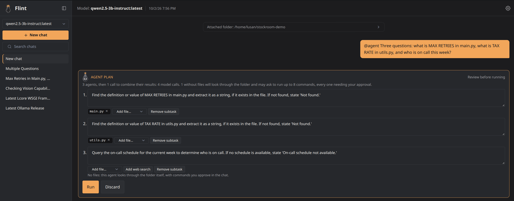
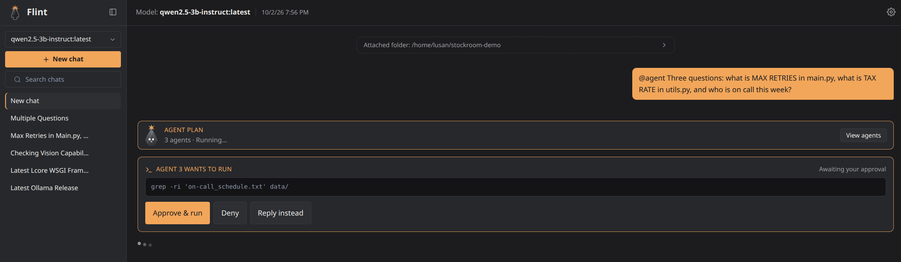
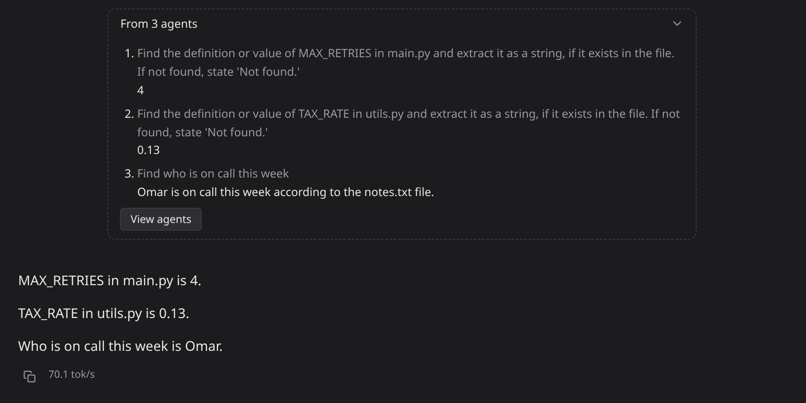
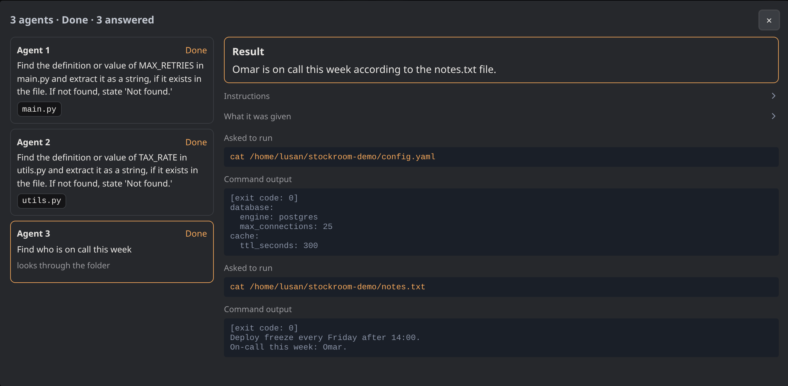

<p align="center">
  
</p>

<h1 align="center">Flint</h1>

<p align="center">A small, fully offline chat UI for local Ollama models, built to get the most out of small models.</p>

<p align="center">
  <a href="https://github.com/Lusan-sapkota/Flint/releases"></a>
  <a href="https://flint.lusansapkota.com.np">Docs</a> ·
  <a href="docs/changelog.md">Changelog</a>
</p>

No CDN calls, no telemetry, no cloud dependency. Everything the frontend
needs is vendored, and the backend only talks to your Ollama. The one
deliberate exception is `@web <query>`, which searches the web through the
Brave Search API with your own key, only when you ask, sending only the
query text. Ollama cloud models (`:cloud`) run on ollama.com, so Flint tags
them "cloud" and says so in the chat.

**New in 0.2.0:** `@agent <task>` splits a question over your folder into
subtasks, each run by its own agent with a clean context window, and
writes one answer from their results. You approve the plan and every
command an agent asks to run.
([agents](docs/features.md#agents-agent), [changelog](docs/changelog.md))

<p align="center">
  
</p>

## Why

Local-LLM web UIs tend to be either too heavy (bundled RAG, Whisper and
torch stacks in a multi-GB image, just to chat) or too minimal (no history
at all). Flint sits in between: one small Go binary, SQLite, and a light
server-rendered UI.

The bet underneath: a well-guided 3-4B model isn't an inferior model, it's
an under-scaffolded one. The usual bottleneck isn't the model, it's naive
unbounded context, no discipline around tool calls, and no memory. Flint's
job is to be the best possible scaffolding around a small model without
becoming heavy itself.

## Highlights

- **Long chats that never overflow.** A real context budget per request,
  background layered summaries that keep your own words verbatim, and
  `@compact` to condense on demand.
  ([context management](docs/context-management.md))
- **Shell tools you stay in control of.** Attach a folder and the model can
  propose commands through Ollama's native tool calling. Every command
  waits for your approval, a shield blocks catastrophic ones outright, and
  commands that can't work are caught before they reach you.
  ([security](docs/security.md))
- **Agents for questions that span a folder.** `@agent <task>` splits a
  task into subtasks, each run by its own agent with a clean context
  window, then writes one answer from their results. You review and edit
  the plan first; an agent reads the files you give it, or looks through
  the folder with commands you approve, and you can open any agent to
  see exactly what it did. ([agents](docs/features.md#agents-agent))
- **Memory across chats.** `@memory save` keeps what matters (drafts are
  reviewed before saving), `@memory <words>` recalls it, and memories tied
  to a folder load whenever that folder is attached.
- **Web search on request.** `@web <query>`, re-ranked locally with
  Ollama embeddings.
- **Local first, cloud when you choose.** Built and tuned for small local
  models, and Ollama cloud models work too, under the same rules: every
  command still waits for your approval and passes the same safety
  checks. A cloud model is tagged "cloud", its chat says it's sent to
  ollama.com, and it gets its own context window setting.
- **Everything a chat UI needs:** streaming, thinking toggle, images and
  file attachments, chat search, offline math rendering, editable last
  message, automatic titles, model management.
  ([all features](docs/features.md))
- **Tested against real models, and written down.** Every design decision
  in the context pipeline comes with the measurement behind it, including
  the attempts that failed, and a scored benchmark measures each piece of
  scaffolding by switching it off. ([experiments](docs/experiments.md),
  [benchmark](docs/benchmark.md))

## Screenshots

<p align="center">
  
</p>
<p align="center">
  
</p>
<p align="center">
  
</p>
<p align="center">
  
</p>
<p align="center">
  
</p>
<p align="center">
  
</p>

## Who it's for

Flint is a personal tool, built for one person on one machine: mine, a
laptop with a 6 GB GPU running 3-4B models. Everything is sized and tested
for that: the context budgets, the prompts, the models it's tuned on. It
runs on your own computer, listens on localhost, and isn't meant to be
exposed to a network or shared with other people. If you run it on a bigger
rig and something breaks or behaves oddly, please open an issue: that's
exactly the feedback I can't get from my own hardware.

## Quick start

You need [Ollama](https://ollama.com) running with a model pulled, for
example `ollama pull qwen2.5:3b`.

**With Docker** (recommended). Flint runs in the container and talks to
the Ollama already on your machine. No clone needed, just the compose
file and a folder for your data:

```bash
mkdir flint && cd flint && mkdir data
# Linux
curl -O https://raw.githubusercontent.com/Lusan-sapkota/Flint/main/docker-compose.yml
docker compose up -d && echo "Flint is running at http://localhost:${FLINT_PORT:-3141}"
# Mac, Windows (Docker Desktop)
curl -O https://raw.githubusercontent.com/Lusan-sapkota/Flint/main/docker-compose.desktop.yml
docker compose -f docker-compose.desktop.yml up -d && echo "Flint is running at http://localhost:${FLINT_PORT:-3141}"
```

Then open `http://localhost:3141`, a deliberately uncommon port so it
doesn't collide with other dev servers (set `FLINT_PORT` to change it).

To update to a new release, run this in the same folder (add
`-f docker-compose.desktop.yml` on Mac and Windows). Your data in `./data`
is kept:

```bash
docker compose pull && docker compose up -d
docker image prune -f   # optional: remove the old image
```

`latest` only moves for normal releases, not pre-releases like
`v0.2.0-beta`. To stay on one version, pin its tag in the compose file,
for example `ghcr.io/lusan-sapkota/flint:0.1`.

**Or from source**, with Go installed:

```bash
git clone https://github.com/Lusan-sapkota/Flint.git
cd Flint/backend
go run .
```

Then open `http://localhost:8080` and sign up.

Optional, only if you use `@web`: `ollama pull nomic-embed-text` (about
270 MB) lets Flint re-rank search results against your question. It isn't
a dependency. Without it `@web` still works, using Brave's own ranking,
and with it the model only loads for the moment a search runs: Flint has
Ollama unload it as soon as the results are ranked.

Environment variables, Docker notes and which models need which
capabilities: [deployment](docs/deployment.md).

## Docs

Read them at **[flint.lusansapkota.com.np](https://flint.lusansapkota.com.np)**.
They're the Markdown files in [`docs/`](docs/), so they read the same here
on GitHub:

| | | |
|---|---|---|
| Get started | [Install and run](docs/deployment.md) | Docker or source, environment variables, models |
| Using Flint | [Features](docs/features.md) | everything Flint does |
| | [Security](docs/security.md) | accounts, the shell-command safety layers, what leaves the machine |
| How it works | [Architecture](docs/architecture.md) | layout, data model, a chat turn, the streaming protocol |
| | [Context management](docs/context-management.md) | how a chat fits a small window |
| Evidence | [Experiments](docs/experiments.md) | the measurements behind the design |
| | [Benchmark](docs/benchmark.md) | scored tasks, with and without each piece of scaffolding |
| | [Testing](docs/testing.md) | unit tests, live checks, the long-chat run |
| Project | [Changelog](docs/changelog.md) | what changed in each release |
| | [Contributing](CONTRIBUTING.md) | what fits, setup, what a pull request needs |

## Stack

Go and SQLite (pure-Go driver, no cgo) in a single static binary; htmx,
Alpine.js and Pico.css with no build step; [Ollama](https://ollama.com) for
the models.

## License

AGPL-3.0, see [LICENSE](./LICENSE).
