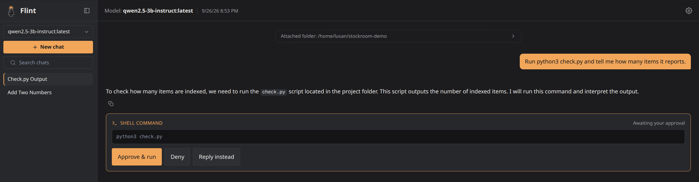
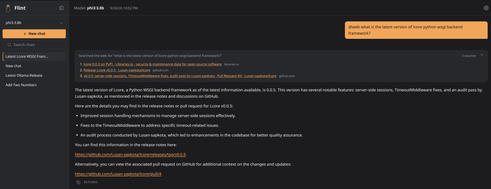
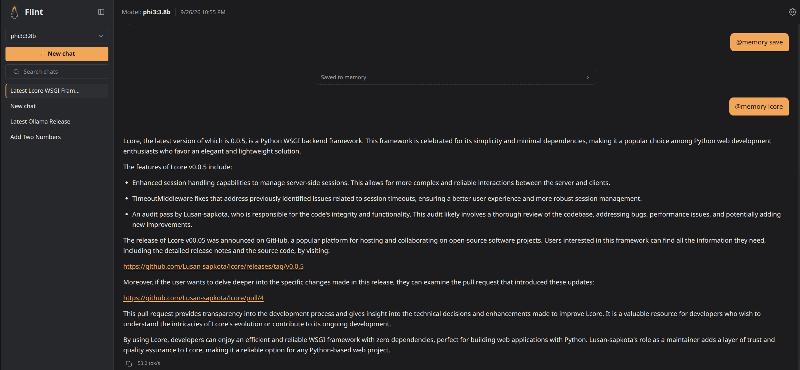

# Flint docs

Flint is a small, fully offline chat UI for local Ollama models: one Go
binary, SQLite, and a light server-rendered UI, with nothing fetched from
a CDN. The idea behind it is that a well-guided 3-4B model isn't an
inferior model but an under-scaffolded one, so Flint's job is to be the
best scaffolding around a small model without getting heavy itself:
context that never overflows, shell commands that always wait for your
approval, memory across chats, and web search only when you ask. Ollama
cloud models work too, under the same rules, tagged as cloud.



## Quick start

With [Ollama](https://ollama.com) running and a model pulled (for example
`ollama pull qwen2.5:3b`), either run it from source:

```bash
git clone https://github.com/Lusan-sapkota/Flint.git
cd Flint/backend
go run .
```

and open `http://localhost:8080`, or run the published Docker image. The
compose files, environment variables and model requirements are in
[deployment](deployment.md).

## Pages

- [Features](features.md): what Flint does, from a user's point of view.
- [Architecture](architecture.md): the pieces, repository layout, data
  model, what happens in a chat turn, and the streaming protocol.
- [Security](security.md): accounts, rate limits, the shell-command
  safety layers, and what leaves the machine.
- [Deployment](deployment.md): running from source or Docker,
  environment variables, health checks, and which models need which
  capabilities.
- [Context management](context-management.md): how a conversation is
  fit into a small model's window.
- [Experiments](experiments.md): the measurements behind each design
  decision, including what failed and was rejected.
- [Benchmark](benchmark.md): the scored benchmark, with and without
  each piece of scaffolding.
- [Testing](testing.md): unit tests, live checks against Ollama, the
  long-chat run and the web re-ranking set.
- [Changelog](changelog.md): what changed in each release.

Tools used in the experiments:
[tools/long_chat.py](tools/long_chat.py), the scripted 19-turn chat, and
[tools/web_rerank.py](tools/web_rerank.py), which scores `@web`
re-ranking on saved, hand-graded searches.

## Screenshots





## Elsewhere

- [Source code](https://github.com/Lusan-sapkota/Flint) and
  [releases](https://github.com/Lusan-sapkota/Flint/releases)
- [Report a bug](https://github.com/Lusan-sapkota/Flint/issues), or a
  security problem privately through the repository's Security tab.

Every change to Flint updates the pages it affects, in the same commit.
